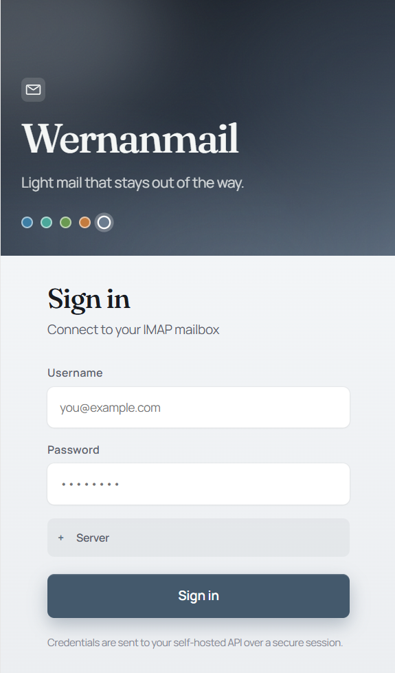

# Wernanmail

Lightweight self-hosted **mail client** (web). Own mail server comes later.

<p align="center">
  
</p>

Sign in connects to your IMAP/SMTP server. Color **moods** (Harbor, Reef, Grove, Ember, Mist, or Auto by time of day) tint the whole client — login, inbox, and settings.

## Product policy

| Principle | Meaning |
|-----------|---------|
| **Light** | Whole product target **~700MB RAM**, recommend **1GB** (not Mailcow-class 6GB+) |
| **Fast** | Keyboard-first UI, snappy inbox, thin Go API |
| **Reliable** | Mailcow-inspired containerization and ops discipline — without Mailcow weight |

Phase 1 = **client** (IMAP/SMTP to existing servers).  
Phase 2 = **server** (own stack, still light).

## Unique feature: **Mailport**

Embeddable mail for other products — iframe / web component / JS SDK.

- Drop inbox or compose into other apps and admin panels
- Same session / scoped API tokens
- Themes match host product

Self-hosted mail that **plugs into your stack**, not only a standalone webmail.

## What’s working now

- Login against real IMAP (session cookie → Go API)
- Three-column inbox: folders · list · reading pane
- **Compose / Reply / Forward** via SMTP
- Settings: language (12 locales), light/dark, fonts, **color moods**
- Docker Compose for `api` + `web` (localhost bind for reverse-proxy deploys)

## Design direction

Default look: **Paper Quiet** — light, calm, readable, three-column mail UI.

Craft details lean on [emil-design-eng](https://github.com/emilkowalski/skills) (press feedback, gated hover, shadows over heavy borders, intentional motion).

In **Settings** (first-class):

- **Font** — user-selectable typefaces for UI / reading
- **Color mood** — full palette (not a single flat accent hex), including Auto
- **Theme** — light / dark
- **Language** — **12 locales** from day one (en, ru, de, fr, es, pt, zh, ja, ko, it, pl, tr)

See [docs/DESIGN.md](docs/DESIGN.md), [docs/POLICY.md](docs/POLICY.md), and more mockups in `docs/mockups/`.

## Stack (MVP client)

| Layer | Choice |
|-------|--------|
| Frontend | React 19 + Vite + TypeScript |
| i18n | `i18next` + `react-i18next` — 12 locale JSON files |
| Dates | `Intl` (locale-aware) |
| Styles | CSS Modules + CSS variables (fonts + mood scales) |
| Backend | Go (chi) + go-imap + SMTP — **error codes**, UI translates |
| Sessions | httpOnly cookies |
| Deploy | Docker Compose, light containers |

## Repo layout

```
web/       # React client
server/    # Go API
docs/      # design, policy, mockups
```

## Quick start (web)

```bash
pnpm --dir web install
pnpm --dir web dev
```

`/api` is proxied to the Go backend on `localhost:8080`.

## Quick start (API)

```bash
cd server
cp .env.example .env   # optional
go run .
```

See [server/README.md](server/README.md) for endpoints. Errors are codes only (e.g. `mail.auth_failed`); the UI translates.

## Run with Docker Compose

Light client + API only (no mail server containers):

```bash
docker compose up --build -d
```

App: http://localhost:3080 (override with `WERNANMAIL_HTTP_PORT` in `.env`).
Copy `.env.example` to `.env` for local port overrides. Keep mailbox credentials in `secrets/` (gitignored).

## Status

Usable MVP client: live IMAP inbox, compose/send, moods + i18n, Compose deploy. Next: denser keyboard shortcuts, Mailport embed, then the light mail **server** phase.

---

*by [baddysays](https://github.com/Baddysays)*
