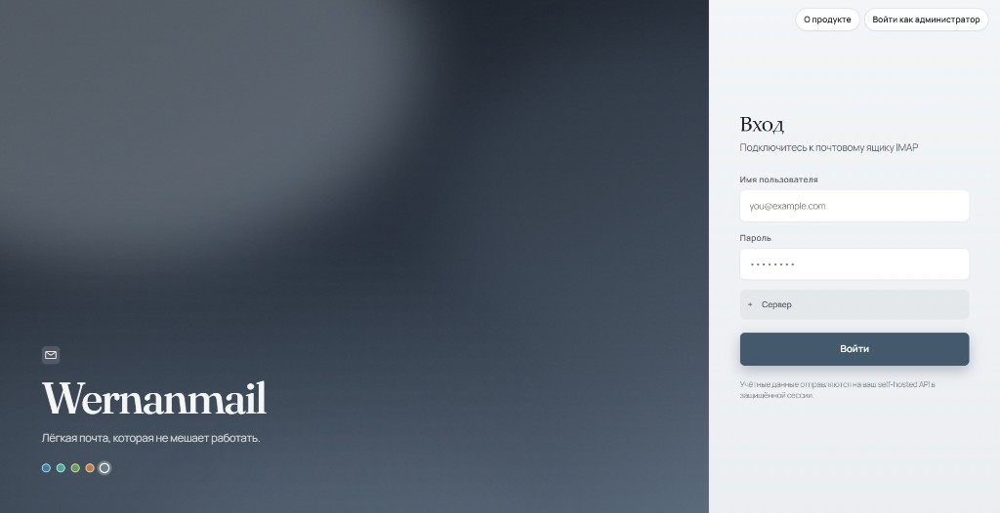
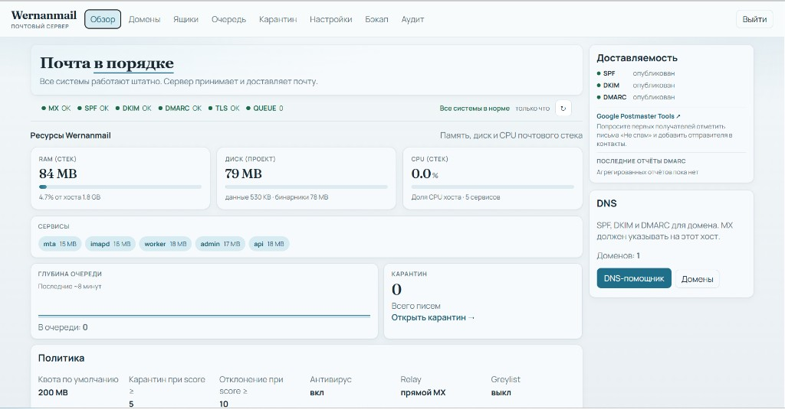
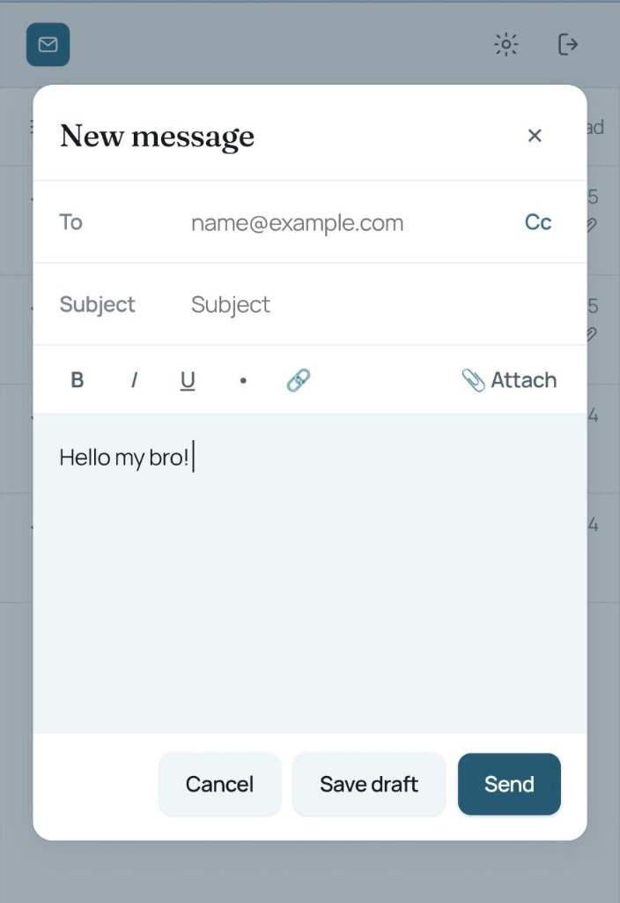
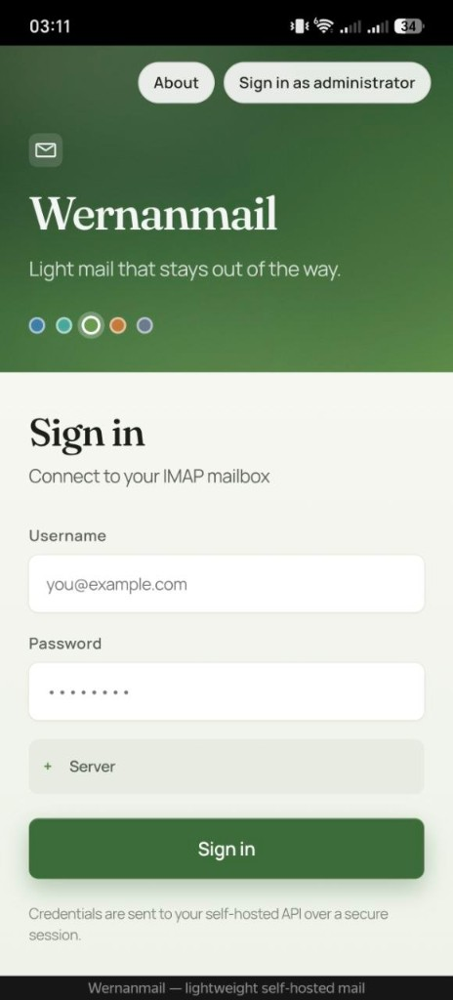
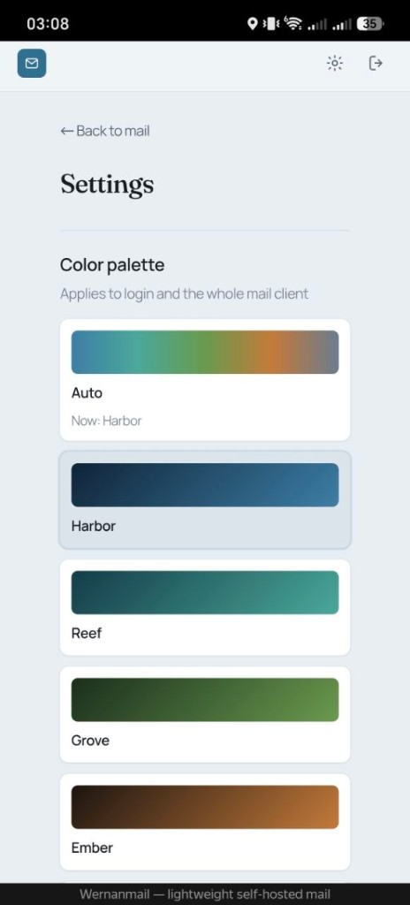

# Wernanmail

**Full corporate mail that stays light.**  
Webmail + Go MTA/IMAP + operator admin — Mailcow-class capability without Mailcow-class RAM.

| | |
|--|--|
| **Running aim** | under **500 MB** |
| **Host** | **1 GB** min · **2 GB** recommended |
| **Install** | **one command** with Docker Compose |
| **Stack** | SMTP · submission · IMAP · queue · webmail · admin |

<p align="center">
  <a href="https://wernanmail.ru"></a>
  &nbsp;
  <a href="https://mail.wernanmail.ru"></a>
  &nbsp;
  <a href="https://mail.wernanmail.ru/admin/"></a>
  &nbsp;
  <a href="https://github.com/Baddysays/wernanmail/actions/workflows/ci.yml"></a>
  &nbsp;
  <a href="LICENSE"></a>
</p>

### Website

Live product site: **[wernanmail.ru](https://wernanmail.ru)** — hero, moods, one-command install, and the story of light self-hosted mail.  
Running instance: **[mail.wernanmail.ru](https://mail.wernanmail.ru)** (webmail) · **[admin](https://mail.wernanmail.ru/admin/)**.

```bash
curl -fsSL https://raw.githubusercontent.com/Baddysays/wernanmail/main/install.sh | bash
```

The installer asks for your **mail hostname**, public URL, and contact email, writes `.env`, starts Docker Compose, prints the admin password, and can request a Let's Encrypt certificate.

<p align="center">
  
</p>

<p align="center">
  
</p>

## Why teams pick it

- **Actually light** — five small Go processes + React SPAs. No SOGo, no ClamAV by default, no multi‑GB baseline.
- **Operator-first admin** — domains, DKIM, DNS helper, Setup checklist, deliverability score, queue, quarantine.
- **Real webmail** — three-pane inbox, HTML compose, attachments, drafts with autosave, search, undo trash, remote-image blocking, 12 languages.
- **Outbound you can trust** — SPF/DKIM/DMARC hooks, MTA-STS/TLS-RPT/BIMI helpers, ARC, DMARC/TLS report storage.
- **Defense without bloat** — MIME-aware light attachment policy + scoring antispam. Optional ClamAV later on larger hosts.
- **Guided install** — hostname prompts, optional Let's Encrypt, clear “what to do next” for DNS.

## Install (first time on a VPS)

**You need:** a Linux VPS, Docker Engine + Compose v2, a domain whose **A/AAAA** already points at this server.

```bash
curl -fsSL https://raw.githubusercontent.com/Baddysays/wernanmail/main/install.sh | bash
```

Or from a git checkout:

```bash
git clone https://github.com/Baddysays/wernanmail.git
cd wernanmail
chmod +x install.sh && ./install.sh
```

The script will ask (in plain language):

1. **Mail hostname** — e.g. `mail.example.com` (not `localhost`)
2. **Public URL** — usually `https://mail.example.com`
3. **Contact email** — for Let's Encrypt notices
4. **Issue TLS now?** — if yes, runs Certbot (port **80** must be open)
5. **Firewall ports?** — shows what is listening / allowed locally and can open UFW or firewalld (cloud security groups and provider blocks on port **25** still need the panel/support)

When it finishes you get:

- Webmail and Admin URLs  
- Admin username/password  
- A short checklist: open Admin → **Setup**, publish DNS, open firewall ports  

Non-interactive / CI:

```bash
WERNANMAIL_NONINTERACTIVE=1 MAIL_HOSTNAME=mail.example.com PUBLIC_URL=https://mail.example.com ./install.sh
```

### After install — finish go-live

1. Open **Admin** → sign in with the printed password  
2. Add your domain → **Generate DKIM**  
3. Follow **Setup — go live** on Overview (and **DNS helper** for copy-paste records)  
4. Publish **MX · SPF · DKIM · DMARC · PTR** at your DNS panel  
5. Open firewall: **25, 587, 143, 80, 443**  
6. If the browser still warns about HTTPS:  
   `./scripts/issue-tls-certbot.sh`  
7. Send a test both ways → watch **Deliverability** (aim for score **8+**)  
8. Schedule backups: `./scripts/backup-data.sh`

Full operator notes: **[docs/SERVER.md](docs/SERVER.md)** · product rules: **[docs/POLICY.md](docs/POLICY.md)**  
Security: **[SECURITY.md](SECURITY.md)** · changes: **[CHANGELOG.md](CHANGELOG.md)** · license: **[MIT](LICENSE)**

```bash
docker compose ps
docker compose logs -f
docker compose restart
docker compose down             # keeps mail + secrets
docker compose down --volumes   # wipe mail + secrets
```

| Surface | URL / port |
|---------|------------|
| Webmail | `https://your-host/` |
| Admin | `https://your-host/admin/` |
| SMTP | `25` |
| Submission (STARTTLS) | `587` |
| IMAP (STARTTLS) | `143` |
| Optional implicit TLS | `465` / `993` via TLS terminator or custom config |

## What ships in the stack

| Piece | Role |
|-------|------|
| **Webmail** | React inbox — compose, folders, undo delete, remote images gated, moods, i18n |
| **MTA** | Inbound SMTP + authenticated submission, pipeline (spam → light AV → store/queue) |
| **IMAP** | Folders, APPEND, IDLE via `content_rev` (~500 ms), quotas |
| **Worker** | Local deliver, outbound SMTP, bounce path |
| **Admin** | Domains, mailboxes, aliases, filters, quarantine learn, DNS/deliverability, settings, audit |
| **Mailport** | Early preview route for future embedded inbox/compose flows |

## Who this is for (honest)

| Scenario | Recommendation |
|----------|----------------|
| Personal / family domain, **1–5 mailboxes**, OK to watch logs | **Yes** — light stack, modern UI, one-command Docker |
| Learning Go MTA / forking a clean mail codebase | **Yes** |
| Small business that needs **“install and forget”** like Mailcow | **Not yet** — still early; antispam is light, no CalDAV/CardDAV, single-node |
| SLA / compliance / thousands of mailboxes | **No** — use Mailcow, Stalwart, or a hosted provider |

## Roadmap notes

- **Mailport** is still a preview surface, not a finished embeddable product
- **Implicit TLS** on `465` / `993` is optional; STARTTLS on `587` / `143` is the default Compose path
- **Host-level ACME** via [`scripts/issue-tls-certbot.sh`](scripts/issue-tls-certbot.sh) (Certbot → `mail_tls` volume)

## Product shots

Real UI, not mock concepts. More screenshots live in [`docs/mockups/`](docs/mockups/).

<p align="center">
  
</p>

<p align="center">
  
  &nbsp;&nbsp;
  
</p>

## Design

**Paper Quiet** — calm teal, three-column mail, soft motion.  
Moods (Harbor / Reef / Grove / Ember / Mist) tint login and the whole client.  
Admin = quiet overview console + operator health strip on working screens.

All shots: [`docs/mockups/`](docs/mockups/) · notes: [docs/DESIGN.md](docs/DESIGN.md)

## Repo map

```
install.sh           one-command Docker entry
docker-compose.yml   full production stack
scripts/             docker-smoke, backup/restore, Certbot TLS helper
web/                 webmail (React + TypeScript)
admin/               operator console (React + TypeScript)
server/              Go: api · mta · imapd · worker · admin · docker-init
docs/                design, policy, server ops, mockups
deploy/              deploy docs + native host helpers
```

## Dev (without Docker)

```bash
cd server && cp .env.example .env && go run ./cmd/api
pnpm --dir web install && pnpm --dir web dev
npm --prefix admin install && npm --prefix admin run dev
```

Native binaries (existing `/opt/wernanmail` installs) remain supported via `./run.sh start`.

## Policy

Light · fast · reliable.  
No secrets or private infra inventory in git. Details: [docs/POLICY.md](docs/POLICY.md)

## Security

Please report security issues privately; see [SECURITY.md](SECURITY.md).

## Acknowledgments / С благодарностью за идеи

Wernanmail stands on the shoulders of the self-hosted mail world.  
**С благодарностью за идеи** — и за то, что показали, как выглядит хорошая корпоративная почта:

| Project | Why we looked |
|---------|----------------|
| **[Mailcow](https://mailcow.email/)** | The operator UX bar: domains, DKIM, quarantine, “it just feels complete” |
| **[Stalwart](https://stalw.art/)** | Modern Rust mail server direction — JMAP/IMAP vision, tight resource story |
| **[Maddy](https://maddy.email/)** | Compositional Go MTA thinking — keep the stack understandable |
| **[Postal](https://docs.postalserver.io/)** | Clean product framing for outbound / ops-facing mail tools |
| **[Mail-in-a-Box](https://mailinabox.email/)** | “One box, go live” install ethos |
| **[Roundcube](https://roundcube.net/)** / webmail classics | What users expect from folders, compose, and reading pane |
| **Postfix / Dovecot / Rspamd / OpenDKIM** | The protocol and auth foundation every serious stack still studies |

None of these projects are affiliated with Wernanmail. We took **ideas and aspirations**, then built our own light path: less RAM, first-class webmail + admin, one Docker command.

---

*Built to feel obvious. Clone it. One command. Own your mail.*

*by [baddysays](https://github.com/Baddysays)*
