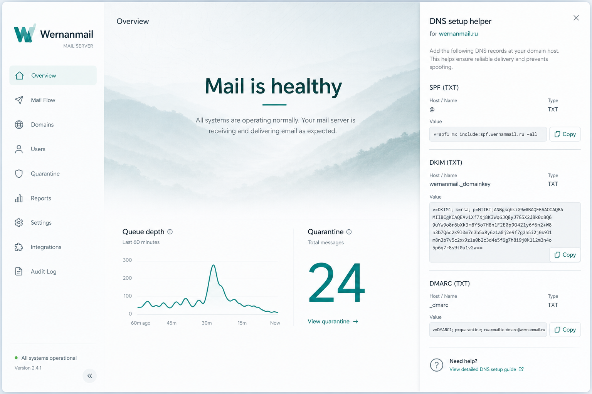
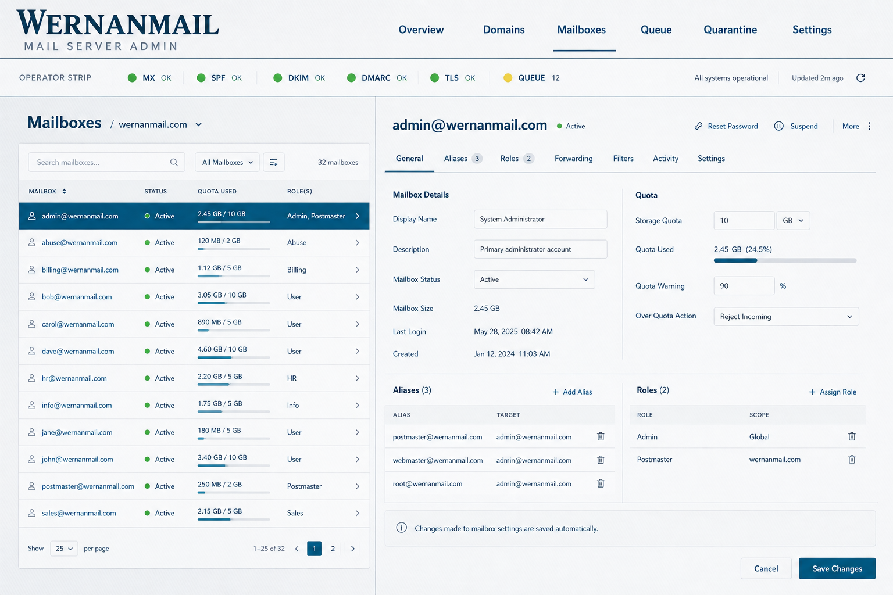

# Wernanmail

**Full corporate mail that stays light.**  
Webmail + Go MTA/IMAP + operator admin — Mailcow-class capability without Mailcow-class RAM.

| | |
|--|--|
| **Running aim** | under **500 MB** |
| **Host** | **1 GB** min · **2 GB** recommended |
| **Install** | **one command** with Docker Compose |
| **Stack** | SMTP · submission · IMAP · queue · webmail · admin |

<p align="center">
  
</p>

<p align="center">
  
</p>

## Why teams pick it

- **Actually light** — five small Go processes + React SPAs. No SOGo, no ClamAV by default, no multi‑GB baseline.
- **Operator-first admin** — domains, DKIM, DNS helper chips (MX/SPF/DKIM/DMARC/TLS), queue, quarantine, deliverability card, mailbox filters.
- **Real webmail** — three-pane inbox, HTML compose, attachments, drafts, search, threading, undo trash, remote-image blocking, 12 languages.
- **Outbound you can trust** — SPF/DKIM/DMARC hooks, MTA-STS helper, DMARC aggregate storage, worker logs that say `outbound ok`.
- **Defense without bloat** — MIME-aware light attachment policy + scoring antispam (URI/heuristics + learn-from-quarantine). Optional ClamAV later on larger hosts.
- **One-command install** — secrets, bootstrap TLS, full stack on `docker compose up --build -d`.

## Install in one command

Linux host with Docker Engine + Compose v2:

```bash
git clone https://github.com/Baddysays/wernanmail.git
cd wernanmail
chmod +x install.sh && ./install.sh
```

Same as:

```bash
docker compose up --build -d
```

That builds and starts **SMTP, submission, IMAP, queue worker, API, webmail, and admin**.  
First boot generates admin password, session key, master password, and a bootstrap TLS cert.

```bash
docker compose run --rm init /app/docker-init show-admin-password
```

| Surface | URL / port |
|---------|------------|
| Webmail | `https://localhost/` |
| Admin | `https://localhost/admin/` |
| SMTP | `25` |
| Submission (STARTTLS) | `587` |
| IMAP (STARTTLS) | `143` |

### Before you go live

1. Copy `.env.example` → `.env` and set `MAIL_HOSTNAME`, `MAIL_EHLO`, `PUBLIC_URL`
2. Replace self-signed certs in the `mail_tls` volume with `fullchain.pem` + `privkey.pem` (Certbot / commercial)
3. Publish DNS: **MX · SPF · DKIM · DMARC · PTR** (MTA-STS / TLS-RPT optional)
4. Open firewall: **25, 465, 587, 993, 443**
5. Send a test both ways → check admin **Deliverability**

Full operator checklist: **[docs/SERVER.md](docs/SERVER.md)** · product rules: **[docs/POLICY.md](docs/POLICY.md)**

```bash
docker compose ps
docker compose logs -f
docker compose restart
docker compose down             # keeps mail + secrets
docker compose down --volumes   # wipe mail + secrets
```

## What ships in the stack

| Piece | Role |
|-------|------|
| **Webmail** | React inbox — compose, folders, undo delete, remote images gated, moods, i18n |
| **MTA** | Inbound SMTP + authenticated submission, pipeline (spam → light AV → store/queue) |
| **IMAP** | Folders, APPEND, IDLE (poll), quotas |
| **Worker** | Local deliver, outbound SMTP, bounce path |
| **Admin** | Domains, mailboxes, aliases, filters, quarantine learn, DNS/deliverability, settings, audit |
| **Mailport** | Embed inbox/compose in other products |

## Design

**Paper Quiet** — calm teal, three-column mail, soft motion.  
Admin = quiet overview console + operator health strip on working screens.

More shots: [`docs/mockups/`](docs/mockups/) · notes: [docs/DESIGN.md](docs/DESIGN.md)

<p align="center">
  
</p>

## Repo map

```
install.sh           one-command Docker entry
docker-compose.yml   full production stack
web/                 webmail (React + TypeScript)
admin/               operator console (React + TypeScript)
server/              Go: api · mta · imapd · worker · admin · docker-init
docs/                design, policy, server ops, mockups
deploy/mail-host/    native binary host helpers
```

## Dev (without Docker)

```bash
cd server && cp .env.example .env && go run ./cmd/api
pnpm --dir web install && pnpm --dir web dev
npm --prefix admin install && npm --prefix admin run dev
```

Native binaries (existing `/opt/wernanmail` installs) remain supported via `./run.sh start`.

## Policy

Light · fast · reliable.  
No secrets or private infra inventory in git. Details: [docs/POLICY.md](docs/POLICY.md)

## Acknowledgments / С благодарностью за идеи

Wernanmail stands on the shoulders of the self-hosted mail world.  
**С благодарностью за идеи** — и за то, что показали, как выглядит хорошая корпоративная почта:

| Project | Why we looked |
|---------|----------------|
| **[Mailcow](https://mailcow.email/)** | The operator UX bar: domains, DKIM, quarantine, “it just feels complete” |
| **[Stalwart](https://stalw.art/)** | Modern Rust mail server direction — JMAP/IMAP vision, tight resource story |
| **[Maddy](https://maddy.email/)** | Compositional Go MTA thinking — keep the stack understandable |
| **[Postal](https://docs.postalserver.io/)** | Clean product framing for outbound / ops-facing mail tools |
| **[Mail-in-a-Box](https://mailinabox.email/)** | “One box, go live” install ethos |
| **[Roundcube](https://roundcube.net/)** / webmail classics | What users expect from folders, compose, and reading pane |
| **Postfix / Dovecot / Rspamd / OpenDKIM** | The protocol and auth foundation every serious stack still studies |

None of these projects are affiliated with Wernanmail. We took **ideas and aspirations**, then built our own light path: less RAM, first-class webmail + admin, one Docker command.

---

*Built to feel obvious. Clone it. One command. Own your mail.*

*by [baddysays](https://github.com/Baddysays)*
